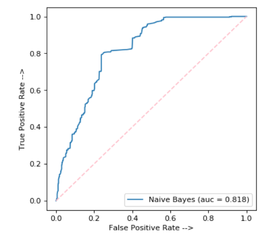

Description:

To implement my Naive Bayes from scratch, I have used Python3 and data analysis to determine the best words to use to divide the likelihood of spam and ham without using the entire wordset to enhance the run-time. Users of my code can select the amount of features (aka words) they would like to use and the number of bins and categories they'd like to use when calculating the likelihood of spam or ham. 

I have also used this dataset on sklearn's logistic regression and sklearn's Gaussian NB to show my proficency in working with sklearn and to compare the results of our metrics in part 1. 

To see my data analysis, visit Part 1 as follows:
Part 1: Deline_Zent_A2_Part1 > Run > Read through answers in cells

To see my Naive Bayes classifier in action, visit Part 2 as follows:
Part 2: Deline_Zent_A2_Part2 > Run All > Read through answers in cells

Additionally, I will show some of the visual data analysis of histograms, AUCS, and more below. 

My Naive Bayes's AUC curve which I created in Python. 

The AUC curve for sklearn's logistic regression and sklearn's gaussian naive bayes.

Correlation of different prevalent ham and spam words utilizing pairplots.

Correlation of different prevalent ham and spam words utilizing a heatmap.

